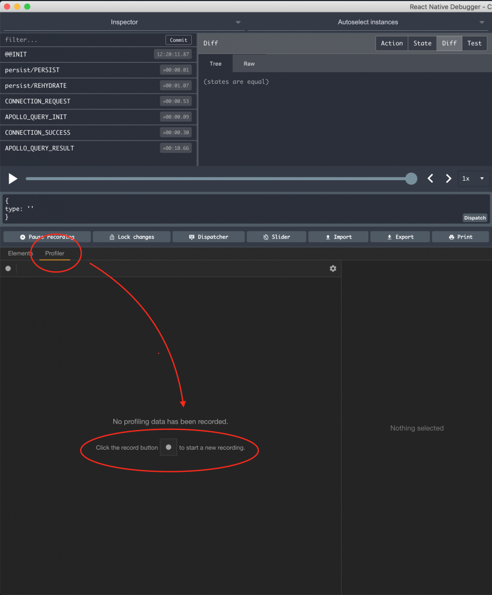
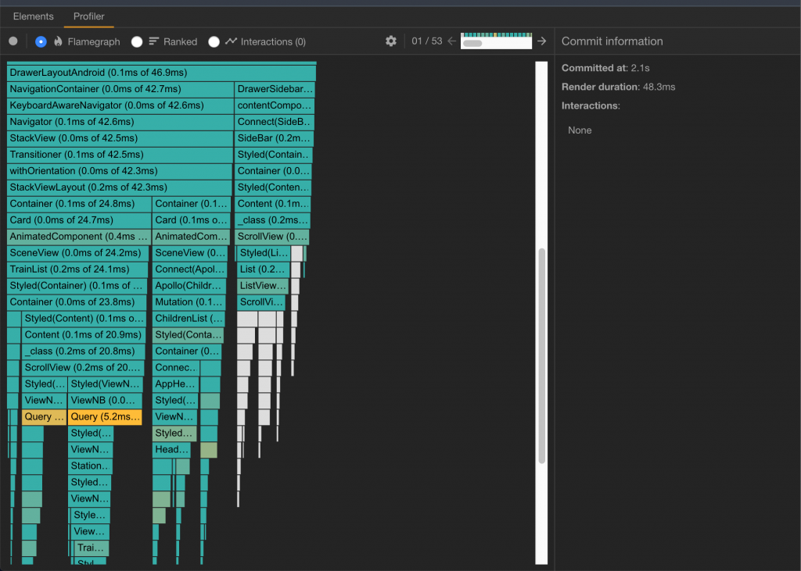

Etre le numéro un sur le marché, garder ses utilisateurs fidèles et gagner face à la concurrence, voilà des objectifs que les éditeurs d'applications veulent absolument atteindre. Cela n'est pas chose facile et passe par un travail important d'UI/UX, d'écoute des utilisateurs mais aussi d'un bon travail d'optimisation et d'amélioration des performances.

Je vais partager dans cet article quelques techniques et outils que j'ai utilisé pour améliorer les performances d'une application React Native.

## Identifier les composants "lents"

Une des manières d'identifier les composants React qui sont lents ou utilisent le plus de ressource est d'utiliser le _Profiler_ de _React Debugger_ (_React Native Debugger_ dans mon cas). Celui permet de voir au moins 2 métrique important : **le nombre de fois** qu'un composant est rendu et le le **temps qu'un rendu prend**.

En mesurant ces 2 éléments, on peut voir si les optimisations que nous effectuons sont efficace ou pas. Il faut donc commencer par "Enregistrer" ces informations durant une utilisation normale de l'application. Pour cela, il faut ouvrir _React Native Debugger_ et se rendre sur l'onglet _Profiler_ puis de cliquer sur le bouton "⏺"



Ouvrir le Profiler et commencer à Enregistrer

Vous pouvez ensuite revenir sur votre application et l'utiliser comme le ferait un utilisateur. Une fois que vous êtes satisfait, arrêtez l'enregistrement sur le Profiler et visualisez les informations qu'il fournit.

Vous voyez tout d'abord la hiérarchie de l'ensemble des composants de votre application sur le _Flamegraph._ Celui-ci permet de visualiser rapidement les composants "gourmands" grace à un système de coloration. Les composants en vert sont plutôt normaux alors que ceux qui commencent à virer vers le jaune, l'orange ou le rouge peuvent présenter des signes de lenteur.



La hiérarchie des composants et leur profil

En cliquant ensuite sur un des ces composants identifié comme potentiellement lent, on obtient plus de détail comme le nombre de fois que le composant est rendu. Plus un composant est rendu, plus il occupe des ressources. Il faut alors identifier si le nombre de rendu est normal compte tenu du fonctionnement attendu de l'application.

Autrement, un nombre élevé de rendu peut provenir d'une mauvaise utilisation dans le code.


Le nombre de rendu d'un composant ainsi que ces parametres

## Quelques pistes d'amélioration

Nous pouvons améliorer les performances de l'application en **réduisant****le nombre de rendu d'un composant autant que possible**. Cela passe tout d'abord par une bonne utilisation des paramètres (props).

Il faut essayer de passer le moins de paramètres possibles au composant et utiliser des paramètres qui changent uniquement quand il faut.

Un exemple assez récurrent de paramètre qui change sans que ce soit nécessaire est l'utilisation de fonctions anonymes. Un des composants que j'ai identifié dans le _Flamegraph_ du Profiler utilisait les paramètres suivants :

```javascript
<Header  
  onPressRight={() => navigation.openDrawer()}  
  onPressLeft={() => navigation.goBack()}  
/>
```

Dans cet exemple, il s'agit du composant utilisé en entête de l'application. Celui-ci ne devrait à priori pas être rendu plusieurs fois car il change très peux. Cependant, en regardant de près le Profiler, on se rend compte que le composant est rendu fréquemment.

Cela vient du fait que les fonctions anonymes utilisées en paramètres ne pointent pas vers une seule référence en mémoire mais est réévaluer à chaque fois. Cela cause ainsi un rendu car React pense que les paramètres du composant ont changé alors qu'au final le comportement attendu est le même.

Pour remédier à cela, nous allons définir une référence fixe à chaque fonction et la réutiliser.

```javascript
// ...  
function _openDrawer(){  
  navigation.openDrawer()  
}  
  
function _goBack(){  
  navigation.goBack()  
}  
  
// ...  
<Header  
  onPressRight={this._openDrawer().bind(this)}  
  onPressLeft={this._goBack().bind(this)}  
/>
```

Une autre amélioration simple à faire est **d'utiliser PureComponent**comme parent des classes de composant React. _PureComponent_ fonctionne comme _Component_ mais évalue les paramètres _en surface_ contrairement à ce dernier.

De ce fait, si un objet est passé en paramètre d'un composant, le rendu n'est pas effectué une seconde fois si les paramètres _en surface_ de l'objet n'ont pas changé.

```javascript
<UserInfo user={{ name: "John Doe", age: 29, meta: { latestLogin:   
"2019-01-01T22:00:01" } }} />  
  
<UserInfo user={{ name: "John Doe", age: 29, meta: { latestLogin: "2019-01-02T08:00:01" } }} />
```

Dans l'exemple ci-dessus, le changement de _latestLogin_ n'entraîne pas un nouveau rendu de ce composant si il étend PureComponent. Il faudra donc choisir d'utiliser ou non PureComponent en fonction du comportement attendu dans l'application.

```javascript
class UserInfo extends React.PureComponent {  
// ...  
}  
  
// VS   
  
class UserInfo extends React.Component {  
// ...  
}  

```

## Un petit pas pour l'homme ...

Voilà deux types d'améliorations possible qui semblent petits mais accumulés sur l'ensemble des composants d'une application, cela peut améliorer ne serait-ce qu'un peut les performances de l'application et rendre les utilisateurs toujours plus satisfaits.

Vous avez peut-être identifié d'autres pistes d'améliorations, merci de les partager en commentaire.

A la prochaine!